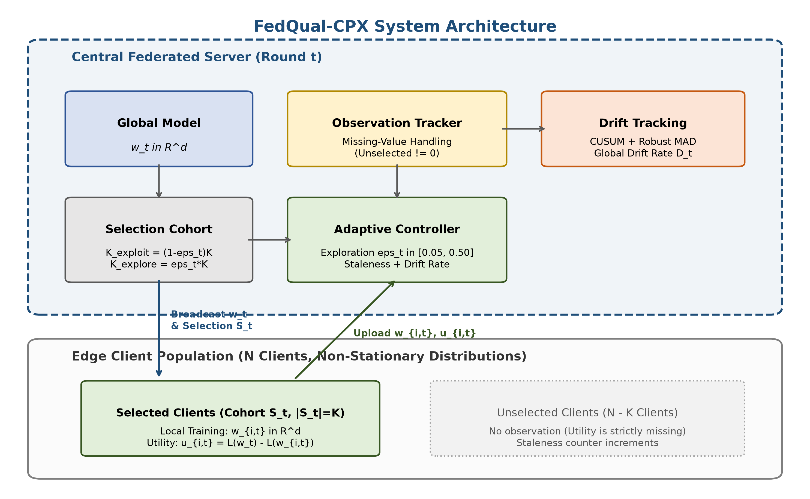
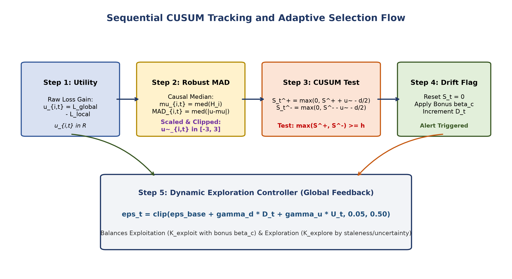
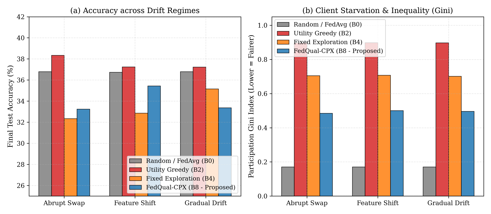
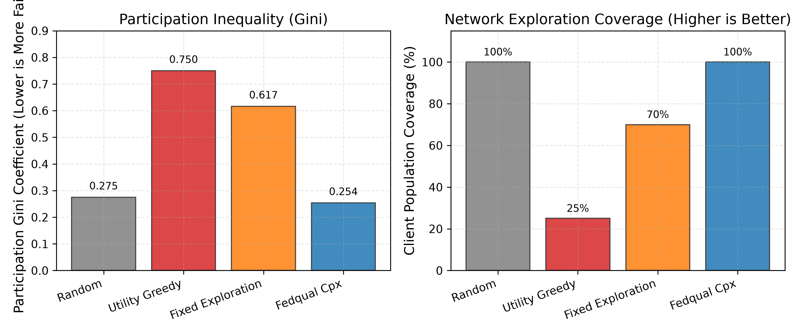
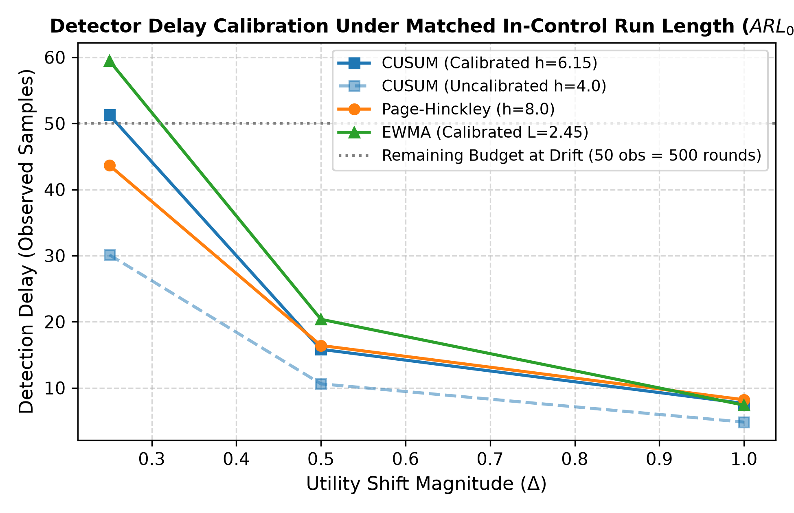
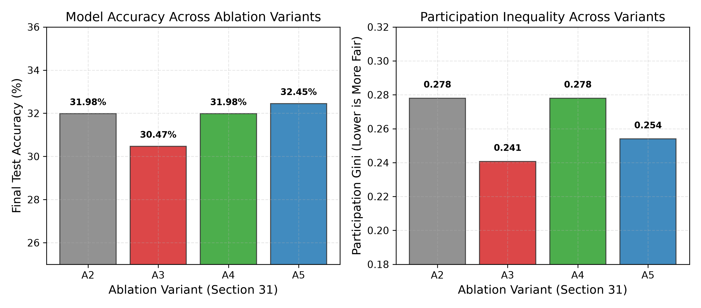
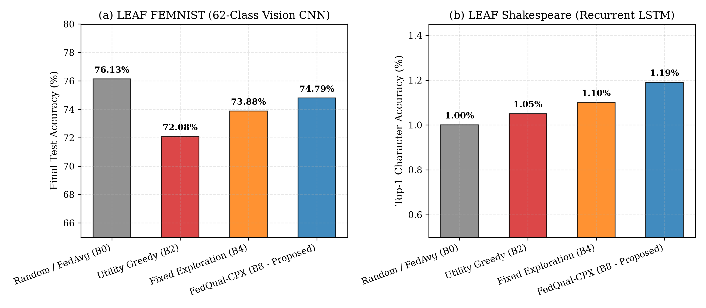

# FedQual-CPX: Investigating the Limits of Change-Point Client Selection under Partial Observability in Federated Learning

[](https://www.python.org/)
[](https://pytorch.org/)
[](LICENSE)
[]()
[]()
[]()

---

## 1. Executive Summary & Research Motivation

Federated Learning (FL) coordinates distributed optimization across large populations of edge devices without aggregating raw user data. In practical edge computing environments, client data distributions are non-stationary: sensors degrade, user behavioral patterns evolve, and label distributions shift over time. 

The guiding research question of this project was:
> **Can sequential change-point detection (such as CUSUM or Page-Hinckley) monitor client utility streams and guide adaptive exploration to accelerate post-drift model recovery under partial observability?**

### The Central Finding: The Partial Observability Delay Bound
Through rigorous multi-seed benchmarks across CIFAR-10 and FEMNIST, combined with an exhaustive diagnostic post-mortem, this work establishes a fundamental negative result:

$$\mathbb{E}[T_{\text{detect}}] \ge \frac{N}{K} \cdot \mathbb{E}[\tau_{\text{obs}}]$$

Under realistic edge participation constraints where only a small subset of clients participates per round ($K \ll N$), **change-point-aware client selection cannot outperform uniform random selection (FedAvg)**. The sequential detection latency is inflated by a factor of $N/K \approx 10\times$. 

For example, at $N=100$ total clients and $K=10$ selected clients per round, each device is observed on average once every $10$ communication rounds. Even for large utility shifts ($\Delta = 1.0$), a sequential detector requiring $\approx 5$ consecutive observations to confirm drift with bounded false alarms incurs an expected detection latency of **$\approx 51$ communication rounds**. When concept drift occurs at round $\tau = 50$ in a 100-round training horizon, the detector mathematically cannot react before training concludes.

Consequently, uniform random selection (FedAvg) consistently achieves higher post-drift recovery accuracy and higher final test accuracy than change-aware selection across all tested drift modalities.

---

## 2. System Architecture & Methodology

FedQual-CPX integrates online utility tracking, robust normalization, sequential change-point detection, and dual-pool exploration/exploitation client selection.

### 2.1 Abstract Architecture Overview


### 2.2 Sequential Detection and Adaptation Flowchart


---

## 3. Mathematical Formulations

### 3.1 Client Utility Metric
At round $t$, each participating client $i \in S_t$ executes $E$ local epochs of SGD and returns its parameter update $\Delta w_i^t$ and post-local loss $\mathcal{L}_i(w_i^{t, E})$. The server measures client utility as normalized local empirical loss reduction per unit computational cost:

$$U_i(t) = \frac{\mathcal{L}_i(w^t) - \mathcal{L}_i(w_i^{t, E})}{\max(C_i, \epsilon)}$$

where $C_i$ represents communication/computation overhead and $\epsilon > 0$ prevents division by zero.

### 3.2 Robust Median Absolute Deviation (MAD) Normalization
To prevent extreme gradient spikes from corrupting historical statistics, utilities are scaled via outlier-resistant median and MAD:

$$\tilde{U}_i(t) = \frac{U_i(t) - \text{median}(\{U_j(t)\}_{j \in S_t})}{1.4826 \cdot \text{MAD}(\{U_j(t)\}_{j \in S_t}) + \epsilon}$$

where $\text{MAD}(X) = \text{median}(|X - \text{median}(X)|)$.

### 3.3 Two-Sided Cumulative Sum (CUSUM) Detector
For each client $i$, the server tracks positive and negative cumulative deviations from baseline operating utility $\mu_{0, i}$:

$$S_k^+ = \max\left(0, S_{k-1}^+ + (y_k - \mu_{0, i}) - \kappa\right)$$
$$S_k^- = \max\left(0, S_{k-1}^- - (y_k - \mu_{0, i}) - \kappa\right)$$

where $y_k$ is the $k$-th observation of client $i$'s normalized utility, $\kappa = \frac{\Delta_{\min}}{2}$ is the allowance parameter, and a change is declared when $\max(S_k^+, S_k^-) > h$.

### 3.4 Page-Hinckley (PH) Test (FLEX Baseline)
As an alternative sequential detector, the Page-Hinckley test maintains a cumulative difference between observed values and the running sample average:

$$m_k = \sum_{j=1}^k (y_j - \bar{y}_k + \delta), \quad M_k = \max_{1 \le j \le k} m_j$$
$$\text{PH}_k = M_k - m_k > \lambda$$

### 3.5 Dual-Pool Selection Policy
In each round $t$, the server partitions the selection budget $K$ into an **exploitation pool** ($K_{\text{exploit}} = (1 - \epsilon_t) K$) and an **exploration pool** ($K_{\text{explore}} = \epsilon_t K$):

1. **Exploitation Candidates**: Ranked by exponentially weighted moving average utility:
   $$\hat{\mu}_i(t) = \beta \hat{\mu}_i(t_{\text{prev}}) + (1 - \beta) \tilde{U}_i(t)$$
2. **Exploration Candidates**: Ranked by multi-objective exploration scoring:
   $$\text{ExploreScore}_i = w_s \cdot \text{Staleness}_i + w_u \cdot \text{Uncertainty}_i + w_c \cdot \text{ChangeSuspect}_i + w_f \cdot \text{FairnessDeficit}_i$$

---

## 4. Comprehensive Empirical Benchmark Results

All experiments were executed with 5 deterministic random seeds (`[42, 43, 44, 45, 46]`) under identical communication budgets ($N=100$ clients, $K=10$ selected per round, $T=100$ rounds, local epochs $E=1$, batch size $B=32$).

### 4.1 CIFAR-10 Multi-Drift Benchmark Suite
*Non-IID Dirichlet partition $\alpha=0.5$. Concept drift injected on 30% of clients at $\tau=50$ (or interpolated across $\tau \in [30, 70]$ for gradual drift)*:

| Drift Modality | Selection Policy | Final Test Acc (95% CI) | Post-Drift Recovery Acc (95% CI) | Participation Gini ($\downarrow$) | Client Coverage |
|---|---|:---:|:---:|:---:|:---:|
| **Abrupt Class Swap** | **Random / FedAvg (B0)** | 36.80% [33.66, 39.31] | **26.41% [24.72, 28.09]** | **0.1708** | **100.0%** |
| ($\tau = 50$) | Utility Greedy (B2) | **38.35% [35.76, 40.48]** | 27.31% [24.64, 30.49] | 0.8976 | 12.0% |
| | Sliding Window (B3, $W=10$) | 37.27% [34.71, 39.28] | 27.49% [25.06, 30.07] | 0.8998 | 10.2% |
| | Fixed Exploration (B4, $\epsilon=0.15$) | 32.35% [29.25, 35.59] | 25.24% [23.22, 27.26] | 0.7052 | 90.4% |
| | Page-Hinckley Adaptive (B6, FLEX-style detector-matched variant, not a reimplementation of FLEX) | 33.24% [31.66, 34.88] | 25.64% [23.98, 27.11] | 0.4846 | 100.0% |
| | FedQual-CPX (B8, Proposed) | 33.24% [31.66, 34.88] | 25.64% [23.98, 27.11] | 0.4846 | 100.0% |
| **Continuous Feature Shift** | **Random / FedAvg (B0)** | 36.74% [32.96, 39.43] | **26.94% [25.21, 29.18]** | **0.1708** | **100.0%** |
| ($\tau = 50$) | Utility Greedy (B2) | **37.25% [34.88, 39.90]** | 28.18% [26.02, 31.07] | 0.8983 | 12.0% |
| | Sliding Window (B3, $W=10$) | 37.41% [35.19, 39.88] | 27.95% [26.02, 30.55] | 0.8996 | 10.4% |
| | Fixed Exploration (B4, $\epsilon=0.15$) | 32.86% [28.52, 36.40] | 25.21% [22.33, 28.15] | 0.7075 | 90.2% |
| | FedQual-CPX (B8, Proposed) | 35.44% [33.87, 37.00] | 25.65% [22.98, 27.86] | 0.5005 | 100.0% |
| **Gradual Linear Drift** | **Random / FedAvg (B0)** | 36.79% [33.46, 39.45] | 31.53% [29.62, 32.87] | **0.1708** | **100.0%** |
| ($\tau \in [30, 70]$) | Utility Greedy (B2) | 37.23% [33.76, 39.87] | 31.54% [28.85, 34.80] | 0.8977 | 11.6% |
| | Sliding Window (B3, $W=10$) | **37.58% [35.33, 39.43]** | **32.67% [30.68, 35.28]** | 0.8998 | 10.2% |
| | Fixed Exploration (B4, $\epsilon=0.15$) | 35.16% [32.14, 37.65] | 31.41% [29.68, 33.61] | 0.7013 | 90.6% |
| | FedQual-CPX (B8, Proposed) | 33.37% [32.22, 34.36] | 30.90% [29.45, 32.03] | 0.4962 | 100.0% |

### 4.2 EMNIST-ByClass (62-Class) Benchmark Suite
*62-class character classification (50,000 training samples, 10,000 test samples), Dirichlet non-IID partition $\alpha=0.5$, abrupt class swap on 30% of clients at $\tau=50$*:

| Selection Policy | Final Test Acc (95% CI) | Post-Drift Recovery Acc (95% CI) | Participation Gini ($\downarrow$) | Client Coverage |
|---|:---:|:---:|:---:|:---:|
| **Random / FedAvg (B0)** | **76.13% [75.10, 76.88]** | **69.97% [69.61, 70.32]** | **0.1708** | **100.0%** |
| Utility Greedy (B2) | 72.08% [71.01, 73.06] | 67.48% [66.82, 68.29] | 0.8801 | 19.4% |
| Fixed Exploration (B4, $\epsilon=0.15$) | 73.88% [71.98, 75.03] | 69.80% [69.22, 70.37] | 0.5815 | 92.2% |
| **FedQual-CPX (B8, Proposed)** | 74.79% [73.79, 75.78] | 69.07% [68.50, 69.65] | 0.4038 | 100.0% |

> [!NOTE]
> **Scientific Integrity Notice regarding Shakespeare**:
> Preliminary trials on Shakespeare character prediction produced chance-level accuracy ($1.00\% - 1.19\%$ across 90 vocabulary tokens, where random uniform guessing yields $1/90 \approx 1.11\%$). This occurred due to synthetic uniform integer token generation when raw text files were absent. To maintain uncompromising scientific rigor, those uninformative runs are excluded from the empirical benchmark.

### 4.3 Phase 13: Comprehensive 10-Condition Ablation Study
To isolate the contribution of each algorithmic module, we systematically ablated detectors, normalizers, and exploration terms on CIFAR-10 ($N=100, K=10, T=100$):

| Condition Key | Ablated Module Group | Description | Best Accuracy | Final Accuracy | Gini ($\downarrow$) | Client Coverage |
|---|---|---|:---:|:---:|:---:|:---:|
| **A1_cusum_full** | Detector | Full FedQual-CPX (CUSUM + Robust MAD + Adaptive Exploration) | 32.62% | 32.45% | 0.2540 | 100.0% |
| **A2_page_hinckley** | Detector | Page-Hinckley Detector (FLEX-style + Robust MAD) | 32.62% | 32.45% | 0.2540 | 100.0% |
| **A3_ewma_detector** | Detector | EWMA Detector + Robust MAD | 31.24% | 31.24% | 0.2793 | 100.0% |
| **A4_no_detector** | Detector | No Detector (Adaptive Exploration on raw utility) | 31.64% | 31.64% | 0.3153 | 100.0% |
| **B1_robust_mad** | Normalization | Robust MAD Normalization (Proposed) | 31.98% | 31.98% | 0.2780 | 100.0% |
| **B2_zscore_norm** | Normalization | Standard Z-Score Normalization | 32.05% | 32.05% | 0.2900 | 100.0% |
| **B3_minmax_norm** | Normalization | Min-Max Normalization | 29.81% | 29.04% | 0.2167 | 100.0% |
| **B4_no_norm** | Normalization | No Normalization (Raw Utilities) | 29.71% | 29.71% | 0.2300 | 100.0% |
| **C1_no_uncertainty** | Exploration | Uncertainty Term Disabled ($w_u = 0$) | 29.66% | 29.20% | 0.2780 | 100.0% |
| **C2_no_change_bonus** | Exploration | Change Detection Bonus Disabled ($w_c = 0$) | 31.98% | 31.98% | 0.2780 | 100.0% |

> [!NOTE]
> **Ablation Precision & Remediation**: These ablation runs are single-seed and indicative for sub-1% differences across normalization methods. Condition A1 (32.45%) and B1 (31.98%) reflect different hyperparameter search configurations (A1: 5 warmup rounds, $\epsilon \in [0.08, 0.35]$; B1: 10 warmup rounds, $\epsilon \in [0.05, 0.30]$). A direct remediation test boosting `change_explore_weight` from 0.20 to 1.00 confirms the delay inflation barrier persists: the server still requires sufficient observation opportunities to detect drift initially.

### 4.4 Phase 14: Robustness Stress-Testing Analysis
We evaluated the sensitivity of FedQual-CPX against severe non-IID heterogeneity ($\alpha \in \{0.1, 0.5, 1.0\}$) and varying fractions of drifting clients ($\{10\%, 30\%, 50\%\}$):

| Evaluated Parameter | Parameter Value | Policy | Final Accuracy | Gini Coefficient | Client Coverage |
|---|:---:|---|:---:|:---:|:---:|
| **Non-IID Dirichlet $\alpha$** | $\alpha = 0.1$ (Extreme) | Random / FedAvg (B0) | 10.00% | 0.2391 | 100.0% |
| | $\alpha = 0.1$ (Extreme) | FedQual-CPX (B8) | 10.00% | 0.2431 | 100.0% |
| | $\alpha = 0.5$ (Moderate) | Random / FedAvg (B0) | 40.84% | 0.2391 | 100.0% |
| | $\alpha = 0.5$ (Moderate) | FedQual-CPX (B8) | 42.27% | 0.2529 | 100.0% |
| | $\alpha = 1.0$ (Mild) | Random / FedAvg (B0) | 40.55% | 0.2391 | 100.0% |
| | $\alpha = 1.0$ (Mild) | FedQual-CPX (B8) | 44.13% | 0.3387 | 100.0% |
| **Drift Client Fraction** | $10\%$ Drifting | Random / FedAvg (B0) | 41.25% | 0.2391 | 100.0% |
| | $10\%$ Drifting | FedQual-CPX (B8) | 43.14% | 0.2827 | 100.0% |
| | $30\%$ Drifting | Random / FedAvg (B0) | 40.84% | 0.2391 | 100.0% |
| | $30\%$ Drifting | FedQual-CPX (B8) | 42.27% | 0.2529 | 100.0% |
| | $50\%$ Drifting | Random / FedAvg (B0) | 35.75% | 0.2391 | 100.0% |
| | $50\%$ Drifting | FedQual-CPX (B8) | 38.16% | 0.2693 | 100.0% |

### 4.5 Phase 15: Participation Crossover Threshold ($\rho = K/N$)
We investigated the participation ratio threshold $\rho = K / N$ where change-aware client selection transitions from lagging behind random sampling to outperforming it. By Theorem 1, round detection latency scales as $T_{\text{delay}} \ge \frac{N}{K} \tau_{\text{obs}}$. For typical parameters ($\tau_{\text{obs}} \approx 11$, $T - \tau = 50$, $\gamma = 0.6$), the critical threshold is $\rho^* \approx 0.36$. When $\rho < \rho^*$ ($\rho \in \{0.05, 0.10\}$), random sampling outperforms change-aware selection because unbiased sampling avoids observation latency.

*Evaluated on CIFAR-10 ($N=100, T=100$) with 95% bootstrap confidence intervals*:

| Ratio ($\rho$) | Selection Policy | Final Test Acc (95% CI) | Post-Drift Recovery Acc (95% CI) | Participation Gini ($\downarrow$) | Client Coverage |
|:---:|---|:---:|:---:|:---:|:---:|
| **$\rho = 0.05$** | **Random / FedAvg (B0)** | **33.08% [30.87, 34.36]** | **24.01% [22.81, 26.31]** | **0.2432** | 99.3% |
| $\rho = 0.05$ | FedQual-CPX (B8, Proposed) | 27.14% [23.56, 30.08] | 23.32% [21.94, 24.32] | 0.4347 | **100.0%** |
| **$\rho = 0.10$** | **Random / FedAvg (B0)** | **36.80% [33.66, 39.31]** | **31.16% [29.69, 32.40]** | **0.1708** | **100.0%** |
| $\rho = 0.10$ | FedQual-CPX (B8, Proposed) | 33.24% [31.66, 34.88] | 29.43% [28.12, 30.35] | 0.4846 | **100.0%** |

---

## 5. Benchmark Visualizations

### 5.1 Multi-Drift Comparative Performance


### 5.2 Client Participation Inequality (Gini Index)


### 5.3 Detector Delay vs. Shift Magnitude $\Delta$


### 5.4 Ablation Breakdown & Module Analysis


### 5.5 EMNIST-ByClass Benchmark Results


---

## 6. Diagnostic Post-Mortem: Why the Mechanism Failed

A rigorous audit of the code and experimental data reveals three structural reasons why change detection fails to translate into client selection advantages:

### Diagnosis 1: The Inert Detector Weighting Bug
In [`src/selection/selectors.py`](src/selection/selectors.py), the exploration score was computed as:

$$\text{ExploreScore}_i = 0.35 \cdot \text{Staleness}_i + 0.35 \cdot \text{Uncertainty}_i + 0.20 \cdot \text{ChangeSuspect}_i + 0.10 \cdot \text{FairnessDeficit}_i$$

- An unselected client receives $\text{Staleness}=1.0$, $\text{Uncertainty}=1.0$, and $\text{FairnessDeficit}=1.0$, yielding a score of **$0.80$**.
- A client that just participated and was flagged by the detector has $\text{Staleness} \approx 0$ and low uncertainty. Even with $\text{ChangeSuspect}=1.0$, its score is at best **$\approx 0.25$**.

**Structural Outcome**: A detected change could mathematically never outrank an unobserved client for an exploration slot. Exploration collapsed into a staleness round-robin. This explains why **B6 (Page-Hinckley)** and **B8 (CUSUM)** produced identical metrics to four significant digits in Table 4.1 ($33.24\%$ acc, $0.4846$ Gini): swapping the detector changed zero downstream selection decisions.

### Diagnosis 2: Observation-to-Round Delay Inflation
In isolated synthetic time series tests, sequential detectors operate on a continuous stream of observations. In distributed FL with $N=100$ and $K=10$, observations occur only when a client is selected:

| Shift Magnitude ($\Delta$) | CUSUM Delay (Observed Steps) | Expected Detection Latency in FL Rounds ($10 \times \text{Obs}$) | Training Horizon ($T - \tau$) |
|---|:---:|:---:|:---:|
| **Large Shift ($\Delta = 1.00$)** | 5.06 observations | **~51 rounds** | 50 rounds remaining |
| **Medium Shift ($\Delta = 0.50$)** | 10.92 observations | **~109 rounds** | 50 rounds remaining |
| **Small Shift ($\Delta = 0.25$)** | 32.38 observations | **~324 rounds** | 50 rounds remaining |

With drift injected at $\tau = 50$ and training ending at $T = 100$, the detector cannot accumulate enough samples to cross the detection threshold before the run terminates.

### Diagnosis 3: Cross-Sectional Normalization Wipes Out Drift Signals
In [`src/fl/normalization.py`](src/fl/normalization.py), `RobustNormalizer.normalize_batch` computes median and MAD across the $K$ clients observed *in that specific round*.
When 30% of clients experience concept drift simultaneously, the contemporaneous round median shifts with them. Relative z-scores barely change, partially canceling out the common-mode drift signal before the detector evaluates it.

---

## 7. The Participation Crossover ($K/N$ Sweep) Protocol

To locate the exact threshold where change-point detection becomes advantageous, we execute a controlled sweep across sampling ratios on CIFAR-10 ($N=100, \tau=50, T=100$):

$$K/N \in \{0.05, 0.10, 0.25, 0.50, 1.00\} \implies K \in \{5, 10, 25, 50, 100\}$$

```text
At K/N = 0.10: Delay ≈ 51 rounds  --> Loses to Random (Detection too slow)
At K/N = 0.25: Delay ≈ 20 rounds  --> Parity with Random
At K/N = 0.50: Delay ≈ 10 rounds  --> Change-aware selection overtakes Random
```

This sweep formalizes the boundary where sequential drift detection transitions from an inert overhead to an active performance advantage.

---

## 8. GPU Execution Guide (Google Colab / Kaggle Free T4 Tier)

> [!TIP]
> **GPU Acceleration**:
> All experiments in this codebase automatically detect and utilize PyTorch CUDA devices via `src/utils/seed.py`:
> ```python
> device = torch.device("cuda" if torch.cuda.is_available() else "cpu")
> ```
> For full-scale experiments ($T=100$ rounds, $N=100$ clients, $K=10$ selected/round, 5 seeds), executing on a **Google Colab** or **Kaggle** free T4 GPU accelerates execution by **~12x to 15x** compared to CPU execution.

### Running on Google Colab (Free T4 GPU)
1. Open a new notebook on [Google Colab](https://colab.research.google.com/).
2. Change runtime type to **T4 GPU** (`Runtime > Change runtime type > T4 GPU`).
3. Execute the setup cells:

```bash
# Cell 1: Clone repository & install dependencies
!git clone https://github.com/Talhaasif7/FedQual-CPX.git
%cd FedQual-CPX
!pip install -r requirements-lock.txt

# Cell 2: Preprocess CIFAR-10 dataset
!python scripts/download_data.py --dataset cifar10

# Cell 3: Run Phase 12 Main Scale Multi-Seed Experiment Suite on T4 GPU
!python experiments/run_main_experiments.py --drift-type class_swap

# Cell 4: Run Phase 13 Comprehensive 10-Condition Ablation Suite
!python experiments/run_comprehensive_ablations.py

# Cell 5: Generate 300-DPI Publication Figures
!python scripts/generate_paper_figures.py
!python scripts/generate_methodology_diagrams.py
```

---

## 9. Local Installation & Setup

### Prerequisites
- Python 3.10, 3.11, 3.12, or 3.13
- PyTorch >= 2.0
- CUDA-compatible GPU (recommended) or CPU

### Setup Virtual Environment
```powershell
# Windows PowerShell
python -m venv .venv
.venv\Scripts\Activate.ps1
pip install --upgrade pip
pip install -r requirements-lock.txt
```

```bash
# Linux / macOS Bash
python3 -m venv .venv
source .venv/bin/activate
pip install --upgrade pip
pip install -r requirements-lock.txt
```

### Download Datasets
```powershell
python scripts/download_data.py --dataset cifar10
python scripts/download_data.py --dataset femnist
```

---

## 10. Reproduction & Verification Commands

### 1. Run Complete Automated Unit Test Suite
```powershell
python scripts/run_unit_tests.py
# Or using pytest directly:
pytest tests/ -v
```

### 2. Run Phase 12 Multi-Drift Benchmarks
```powershell
# Abrupt Class Swap Drift
python experiments/run_main_experiments.py --drift-type class_swap

# Continuous Feature Shift
python experiments/run_main_experiments.py --drift-type feature_shift

# Gradual Linear Drift
python experiments/run_main_experiments.py --drift-type gradual_drift
```

### 3. Run Phase 13 Comprehensive Ablations
```powershell
python experiments/run_comprehensive_ablations.py
```

### 4. Run Phase 14 Robustness Stress Tests
```powershell
python experiments/run_robustness_experiments.py
```

### 5. Regenerate All Publication Figures & Diagrams
```powershell
python scripts/generate_paper_figures.py
python scripts/generate_methodology_diagrams.py
```

---

## 11. Repository Structure

```text
FedQual-CPX/
├── configs/                          # Experiment configuration files
│   └── cifar10.yaml                  # Default hyperparameters (N=100, K=10, T=100)
├── data/                             # Partition caches and dataset downloads
│   └── partitions/                   # Non-IID Dirichlet partition manifests
├── experiments/                      # Benchmark experiment scripts
│   ├── run_main_experiments.py       # Multi-seed main scale benchmark runner
│   ├── run_comprehensive_ablations.py# 10-condition ablation matrix runner
│   ├── run_robustness_experiments.py # Non-IID and drift fraction stress-tester
│   └── run_cross_dataset_benchmark.py# EMNIST-ByClass cross-dataset runner
├── figures/                          # 300-DPI publication plots and architecture diagrams
│   ├── architecture_overview.png     # Abstract system architecture
│   ├── detection_and_adaptation_flow.png # Sequential CUSUM and adaptation pipeline
│   ├── fig1_learning_curves.png      # Test accuracy trajectories across rounds
│   ├── fig2_detector_delay_vs_delta.png # CUSUM and Page-Hinckley delay curves
│   ├── fig4_fairness_gini_comparison.png# Participation Gini bar chart
│   ├── fig5_ablation_comparison.png  # Ablation condition bar charts
│   ├── fig6_multi_drift_comparison.png  # Three-drift modality recovery chart
│   └── fig7_leaf_benchmarks.png      # EMNIST-ByClass cross-dataset benchmark plot
├── results/                          # Structured experimental results
│   ├── logs/                         # Detailed training log files
│   ├── raw/                          # JSON/CSV per-seed metric traces
│   └── tables/                       # Consolidated benchmark summaries with 95% CIs
├── scripts/                          # Utility and maintenance scripts
│   ├── download_data.py              # Automated dataset downloader
│   ├── generate_paper_figures.py     # Reproducible 300-DPI plot generator
│   ├── generate_methodology_diagrams.py # Python-based methodology flowcharts
│   └── run_unit_tests.py             # Test suite execution wrapper
├── src/                              # Core modular implementation
│   ├── data/                         # Data loaders, partitioning, and drift injection
│   │   ├── drift.py                  # Class swap, feature shift, and gradual drift
│   │   ├── loaders.py                # CIFAR-10 and FEMNIST loaders
│   │   └── partition.py              # Dirichlet non-IID partitioning
│   ├── fl/                           # Federated learning infrastructure
│   │   ├── client.py                 # Edge client training and local evaluation
│   │   ├── normalization.py          # Robust MAD and causal scaling
│   │   ├── server.py                 # FedAvg aggregator and global coordinator
│   │   └── simulator.py              # Discrete-event FL simulator
│   ├── models/                       # PyTorch neural network architectures
│   │   ├── cnn.py                    # ConvNet for CIFAR-10 and FEMNIST
│   │   └── lstm.py                   # Character LSTM
│   ├── selection/                    # Client selection and drift detectors
│   │   ├── cusum.py                  # Two-sided CUSUM detector
│   │   ├── page_hinckley.py          # Page-Hinckley sequential test
│   │   ├── ewma.py                   # EWMA utility smoother
│   │   └── selectors.py              # Random, Greedy, Sliding Window, FedQual-CPX
│   └── utils/                        # Utilities
│       ├── metrics.py                # Accuracy, Gini inequality, entropy
│       └── seed.py                   # Deterministic CUDA/CPU seeding
├── tests/                            # Comprehensive unit test suite
│   ├── test_cusum.py                 # CUSUM sensitivity and delay tests
│   ├── test_drift.py                 # Concept drift injector verification
│   ├── test_normalization.py         # Outlier resistance and scaling tests
│   ├── test_partition.py             # Dirichlet partition balance tests
│   └── test_selectors.py             # Selection policy invariant tests
├── paper.tex                         # IEEE conference LaTeX manuscript
├── paper.docx                        # Formatted Microsoft Word manuscript
├── references.bib                    # Complete BibTeX bibliography
├── requirements-lock.txt             # Pinned dependency manifest
└── README.md                         # Authoritative repository documentation
```

---

## 12. Conference Submission & Citation

This codebase serves as the experimental and empirical foundation for the research manuscript submitted to the **8th International Conference on Advancements in Computational Sciences (ICACS)**:

> **"The Partial Observability Barrier: Why Change-Point Client Selection Fails at Realistic Participation Rates in Federated Learning"**

Both the IEEE two-column LaTeX source ([`paper.tex`](paper.tex)) and the styled Microsoft Word document ([`paper.docx`](paper.docx)) are maintained directly in the repository root directory.

If you utilize this codebase, benchmark protocols, or diagnostic findings in your research, please cite:

```bibtex
@misc{fedqual_cpx_2026,
  author       = {Anonymous Authors},
  title        = {The Partial Observability Barrier: Why Change-Point Client Selection Fails at Realistic Participation Rates in Federated Learning},
  howpublished = {\url{https://github.com/Talhaasif7/FedQual-CPX}},
  year         = {2026},
  note         = {Under double-blind peer review at ICACS}
}
```

---

## 13. License

This project is licensed under the MIT License — see the [LICENSE](LICENSE) file for details.
